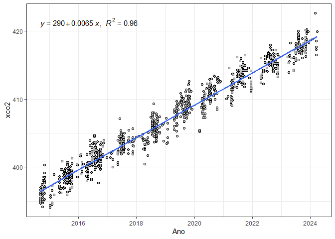
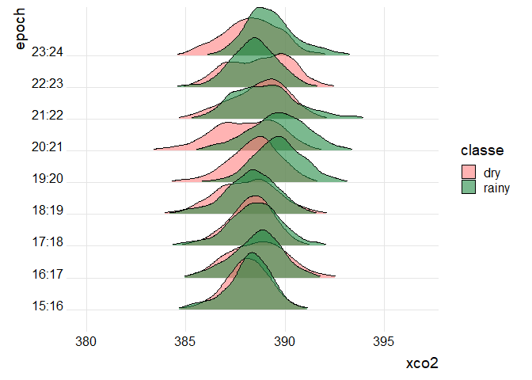

<!-- README.md is generated from README.Rmd. Please edit that file -->

# Análise do Trabalho de Conclusão de Curso:

## Séries temporais de xCO2 no estado de São Paulo

### Pacotes necessários

``` r
library(tidyverse)
library(geobr)
library(fco2r)
```

### Base de dados inicial

``` r
data_set <- fco2r::oco2_br |>  
         mutate(
           xco2 = xco2_moles_mole_1*1e06,
           data = ymd_hms(time_yyyymmddhhmmss),
           ano = year(data),
           mes = month(data),
           dia = day(data),
           dia_semana = wday(data))
glimpse(data_set)
#> Rows: 37,387
#> Columns: 24
#> $ longitude                                                     <dbl> -70.5, -…
#> $ longitude_bnds                                                <chr> "-71.0:-…
#> $ latitude                                                      <dbl> -5.5, -4…
#> $ latitude_bnds                                                 <chr> "-6.0:-5…
#> $ time_yyyymmddhhmmss                                           <dbl> 2.014091…
#> $ time_bnds_yyyymmddhhmmss                                      <chr> "2014090…
#> $ altitude_km                                                   <dbl> 3307.8, …
#> $ alt_bnds_km                                                   <chr> "0.0:661…
#> $ fluorescence_radiance_757nm_uncert_idp_ph_sec_1_m_2_sr_1_um_1 <dbl> 7.272876…
#> $ fluorescence_radiance_757nm_idp_ph_sec_1_m_2_sr_1_um_1        <dbl> 2.537127…
#> $ xco2_moles_mole_1                                             <dbl> 0.000394…
#> $ aerosol_total_aod                                             <dbl> 0.148579…
#> $ fluorescence_offset_relative_771nm_idp                        <dbl> 0.016753…
#> $ fluorescence_at_reference_ph_sec_1_m_2_sr_1_um_1              <dbl> 2.615319…
#> $ fluorescence_radiance_771nm_idp_ph_sec_1_m_2_sr_1_um_1        <dbl> 3.088582…
#> $ fluorescence_offset_relative_757nm_idp                        <dbl> 0.013969…
#> $ fluorescence_radiance_771nm_uncert_idp_ph_sec_1_m_2_sr_1_um_1 <dbl> 5.577878…
#> $ XCO2                                                          <dbl> 387.2781…
#> $ xco2                                                          <dbl> 394.3686…
#> $ data                                                          <dttm> 2014-09…
#> $ ano                                                           <dbl> 2014, 20…
#> $ mes                                                           <dbl> 9, 9, 9,…
#> $ dia                                                           <int> 6, 6, 6,…
#> $ dia_semana                                                    <dbl> 7, 7, 7,…
```

### Plotando os pontos

``` r
data_set |> 
  filter(ano == 2019) |> 
  ggplot(aes(x = longitude, latitude)) + 
  geom_point()
```

<!-- -->

## Função para classificação do ponto

``` r
def_pol <- function(x, y, pol){
  as.logical(sp::point.in.polygon(point.x = x,
                                  point.y = y,
                                  pol.x = pol[,1],
                                  pol.y = pol[,2]))
}
```

## Retirando os polígono

``` r
estados <- geobr::read_state(showProgress = FALSE)
pol_sp <- estados$geom |> pluck(20) |> as.matrix()
plot(pol_sp)
```

<!-- -->

## Classificando os pontos

``` r
data_set_sp <- data_set |> 
  mutate(
    flag_sp = def_pol(longitude, latitude, pol_sp)
  ) |> 
  filter(flag_sp) 

data_set_sp |> 
  ggplot(aes(x = longitude, latitude)) + 
  geom_point()
```

<!-- -->

## Avaliando o sinal de XCO2

``` r
data_set_sp |> 
  ggplot(aes(x=data, y=XCO2)) +
  geom_point()
```

<!-- -->
